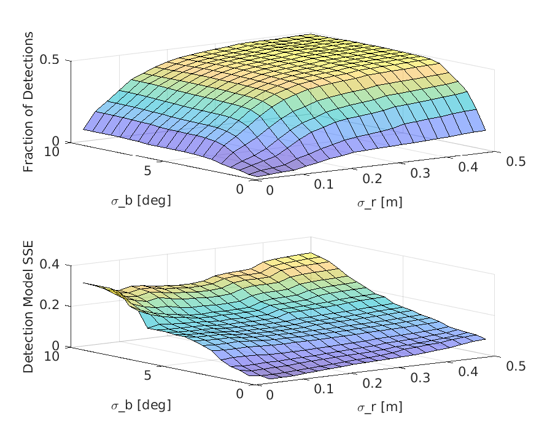
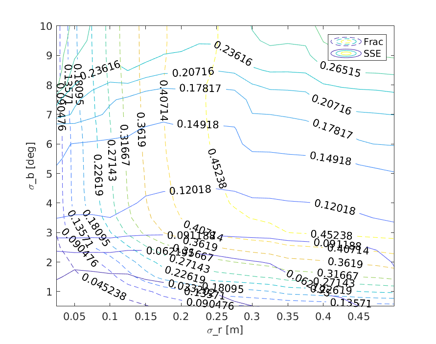
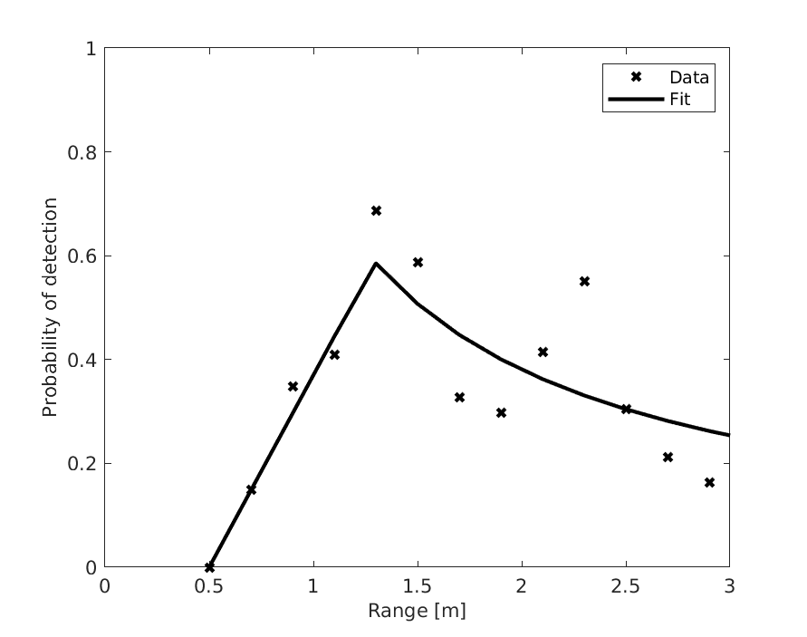
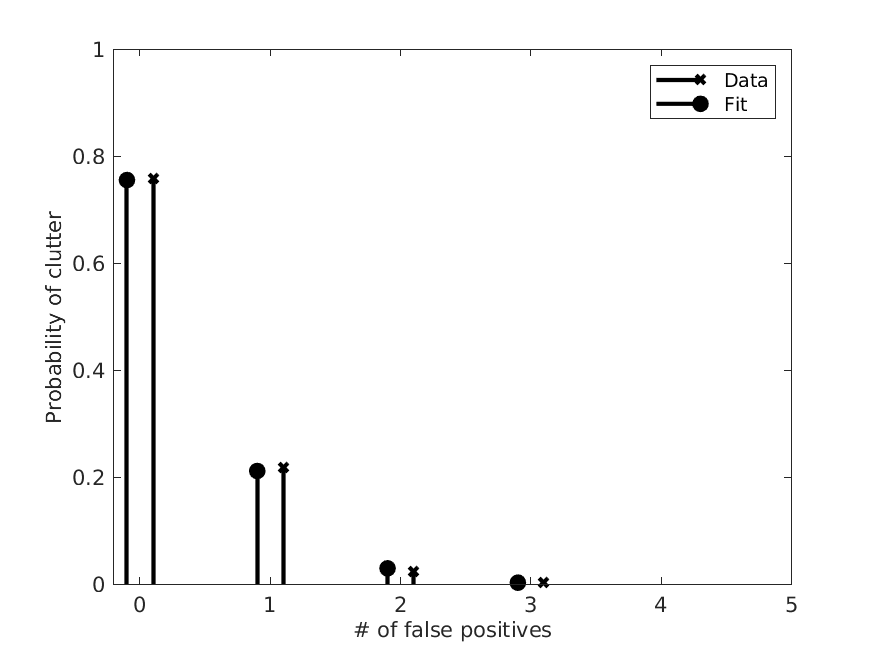
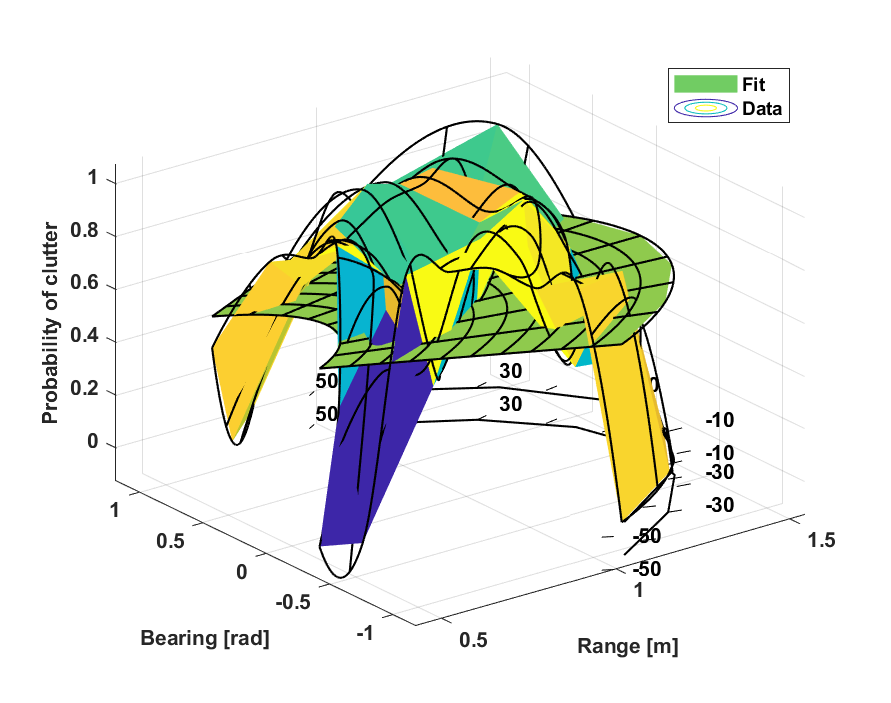

# SPHD Sensor Models
Three sensor models of the Semantic PHD Filter formultiple target tracking: observation model, detection model, and clutter model.

## Custom Measurement Model Dataset:
We drove a turtlebot2 robot equipped with the TX2 embedded device, zed camera and Hokuyo UTM-30LX laser around the lobby environment in the College of Engineering building at Temple University for 20 min to collect measurements of 12 targets at known positions.
We use the YOLOv3-tiny detection algorithm to find labeled bounding boxes for each object and extract instantaneous estimates of these objects.
The collected measurement model dataset consists of 2725 measurement sets (i.e., object classes and its position)) containing 3492 individual measurements.

**Name** 
* measurement_model.bag

**Duration**
* 19:59s (1199s)

**Topics**
* /darknet_ros/detection_image     3543 msgs    : sensor_msgs/Image         
* /map                                1 msg     : nav_msgs/OccupancyGrid    
* /sphd_measurements               3585 msgs    : sphd_msgs/SPHDMeasurements
* /tf                            142727 msgs    : tf2_msgs/TFMessage        
* /tf_static                          1 msg     : tf2_msgs/TFMessage

**Message Types**
* nav_msgs/OccupancyGrid     
* sensor_msgs/Image          
* sphd_msgs/SPHDMeasurements 
* tf2_msgs/TFMessage    
 
**Download link**
* https://zenodo.org/record/7065974
* DOI: 10.5281/zenodo.7065974

## SPHD Senosr Models:
Three sensor models generated by our custom measurement dataset, using in our SPHD filter paper "The Semantic PHD Filter for Multi-class TargetTracking: From Theory to Practice".

**Requirements**
* Ubuntu 16.04
* ROS Kinetic 
* Matlab 2020
* Python 2.7

**Usage**
* Download our custom measurement rosbag dataset to the './measurement_model_dataset' folder:
```Bash
cd ./measurement_model_dataset
weget 
tar -zvxf measurement_model.bag
```

***Observation Model***
* Extract observation data:
```Bash
cd ./src/python/sphd_observation_model
python sphd_observation_model.py
```
* Grid search to find the optimal measurement noise parameters:
```Bash
cd ./src/matlab
# open matlab to run 'observationModelSearch.m'
matlab -nodesktop -nosplash -r observationModelSearch
```
* the resulting figure is shown in below:
<p float="left">
  
   
</p>

***Detection Model***
* Extract detection data:
```Bash
cd ./src/python/sphd_detection_model
python sphd_detection_model.py
```
* Grid search to find the optimal detection parameters:
```Bash
cd ./src/matlab
# open matlab to run 'detectionModelSearch.m'
matlab -nodesktop -nosplash -r detectionModelSearch
```
* the resulting figure is shown in below:
<div align=center>  </div>

***Clutter Model***
* Extract clutter data:
```Bash
cd ./src/python/sphd_clutter_model
python sphd_clutter_model.py
```
* Grid search to find the optimal clutter cardinality parameters:
```Bash
cd ./src/matlab
# open matlab to run 'clutterCardinalitySearch.m'
matlab -nodesktop -nosplash -r clutterCardinalitySearch
```
* the resulting figure is shown in below:
<div align=center>  </div>

* Dispaly the clutter probability fitting model:
```Bash
cd ./src/matlab
# open matlab to run 'clutterModelSearch.m'
matlab -nodesktop -nosplash -r clutterModelSearch
```
* the resulting figure is shown in below:
<div align=center>  </div>

## Citation
```
@article{chen2022semantic,
  title={The semantic PHD filter for multi-class target tracking: From theory to practice},
  author={Chen, Jun and Xie, Zhanteng and Dames, Philip},
  journal={Robotics and Autonomous Systems},
  volume={149},
  pages={103947},
  year={2022},
  publisher={Elsevier}
}

@article{xie2022dataset,
  title={Experimental Datasets and Processing Codes for the Semantic PHD Filter},
  author={Xie, Zhanteng and Chen, Jun and Dames, Philip},
  year={2022},
}


```


